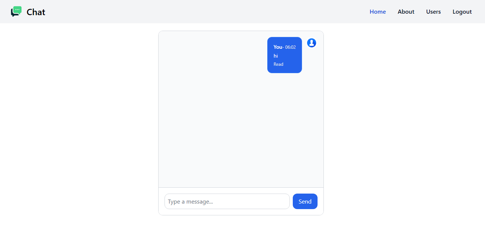

# Chat Application

A real-time chat application built with **Laravel**, **Laravel Echo**, **Reverb (WebSockets)**, and **Tailwind CSS** for the front-end. The app allows users to send and receive messages instantly, with a clean and responsive UI.

---

## 🌟 Features

- Real-time messaging between users using **WebSockets**.
- Dynamic chat interface with **Tailwind CSS** styling.
- Responsive design for all screen sizes.
- User authentication with Laravel.
- Message status indicators (Delivered / Read).
- Easy-to-extend for group chats or multimedia support.

---

## 🛠 Tech Stack

| Layer | Technology |
|-------|------------|
| Backend | Laravel 10, PHP 8.x |
| Frontend | Blade, Tailwind CSS, Flowbite |
| Real-Time | Laravel Echo, Reverb WebSockets |
| Database | MySQL |
| Tools | Vite, Axios, jQuery |

---

## 📷 Screenshots

**Landing Page**


**Responsive Design**




---

## 🚀 Installation & Setup

1. **Clone the repository**
```bash
git clone https://github.com/ripon-coder/Chat-App.git
cd Chat-App

cp .env.example .env
./vendor/bin/sail artisan key:generate


# Start Sail container and install composer dependencies
./vendor/bin/sail up -d
./vendor/bin/sail composer install

# Migration
./vendor/bin/sail migration:fresh --seed

# Install npm dependencies inside the container
./vendor/bin/sail npm install
./vendor/bin/sail npm run dev

# Reverb Port
REVERB_HOST=host.docker.internal
REVERB_PORT=6001

# Reverb Start
./vendor/bin/sail artisan reverb:start --host=0.0.0.0 --port=6001 --debug
